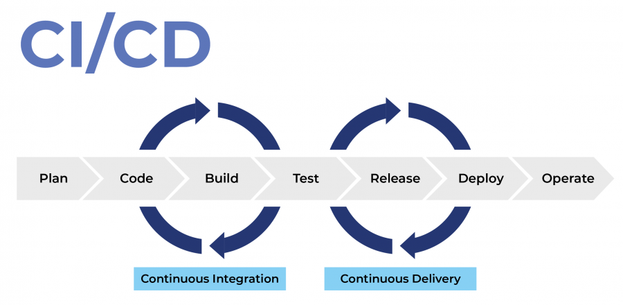

# Project Documentation - Website Deployment with CI/CD and Docker on EC2

## Project Background
EN: 
In this project, I am deploying a website to a production server on AWS EC2, where EC2 acts as the web server. This setup involves Docker services to containerize the application, allowing each component of the application (database, backend, frontend) to run in isolated environments. 

Additionally, I am implementing CI/CD automation using GitHub Actions to ensure that code changes are tested and deployed automatically, increasing deployment efficiency and reducing the likelihood of errors. The CI/CD pipeline includes build testing, image delivery, and deployment stages.

ID:  
Dalam proyek ini, saya akan melakukan deployment sebuah website ke server produksi di AWS EC2, di mana EC2 bertindak sebagai web server. Setup ini menggunakan layanan Docker untuk mengontainerisasi aplikasi, memungkinkan setiap komponen aplikasi (database, backend, frontend) berjalan dalam lingkungan terisolasi. 

Selain itu, saya menerapkan otomasi CI/CD menggunakan GitHub Actions untuk memastikan bahwa setiap perubahan kode diuji dan di-deploy secara otomatis, meningkatkan efisiensi deployment dan mengurangi kemungkinan terjadinya error. Pipeline CI/CD ini mencakup tahapan build testing, image delivery, dan deployment.

---

## Steps

### 1. Create an AWS EC2 Instance
EN:  
I started by creating an EC2 instance on AWS, selecting a Linux-based image (Ubuntu) for compatibility with Docker and other software. In the instance’s security group settings, I configured the following ports:

- **Port 80 and 443**: To allow HTTP and HTTPS traffic to access the web server.
- **Port 5000 and 3000**: These ports are designated for the backend and frontend services.

This configuration ensures the application services are accessible and allows secure communication with the web server.

ID:  
Saya mulai dengan membuat instance EC2 di AWS, memilih image berbasis Linux (Ubuntu) agar kompatibel dengan Docker dan software lainnya. Pada pengaturan security group instance, saya mengonfigurasi port berikut:

- **Port 80 dan 443**: Untuk memungkinkan lalu lintas HTTP dan HTTPS mengakses web server.
- **Port 5000 dan 3000**: Port ini ditetapkan untuk layanan backend dan frontend.

Konfigurasi ini memastikan bahwa layanan aplikasi dapat diakses dan memungkinkan komunikasi yang aman dengan web server.

---

### 2. SSH into EC2 and Install Docker & Nginx
EN:  
After configuring the EC2 instance, I connected to it via SSH and proceeded with installing Docker, Docker Compose, and Nginx. Docker is used to run the application’s containerized services, while Nginx serves as the reverse proxy server to manage incoming web traffic. 

Nginx will also handle SSL termination to secure the website, which I will set up later using Certbot for free SSL certificates.

ID:  
Setelah mengonfigurasi instance EC2, saya menghubungkannya melalui SSH dan melanjutkan instalasi Docker, Docker Compose, serta Nginx. Docker digunakan untuk menjalankan layanan aplikasi yang dikontainerisasi, sedangkan Nginx berfungsi sebagai reverse proxy server untuk mengelola lalu lintas web yang masuk. 

Nginx juga akan menangani terminasi SSL untuk mengamankan website, yang akan saya atur nanti menggunakan Certbot untuk mendapatkan sertifikat SSL gratis.

---

### 3. Docker Compose Configuration
EN:  
In Docker Compose, I configured three main services:

- **Database Service**:  
  Runs a PostgreSQL container to store and manage application data. Persistent data storage is enabled using Docker volumes to ensure data is not lost when containers are restarted. Environment variables like `POSTGRES_USER` and `POSTGRES_PASSWORD` are set to secure access.

- **Backend Service**:  
  This service builds and runs the backend application, which is dependent on the database. The backend service connects to PostgreSQL for data operations, and I included necessary environment variables for database connection details.

- **Frontend Service**:  
  The frontend service runs in a Node.js container, connecting to both the backend and database services. This setup ensures that the frontend can retrieve and display data processed by the backend.

Each service in Docker Compose is configured to start automatically and interconnect as needed, making it easier to manage and scale the application.

ID:  
Dalam Docker Compose, saya mengonfigurasi tiga layanan utama:

- **Database Service**:  
  Menjalankan kontainer PostgreSQL untuk menyimpan dan mengelola data aplikasi. Penyimpanan data yang persisten diaktifkan menggunakan volume Docker agar data tidak hilang saat kontainer di-restart. Variabel lingkungan seperti `POSTGRES_USER` dan `POSTGRES_PASSWORD` diatur untuk mengamankan akses.

- **Backend Service**:  
  Layanan ini membangun dan menjalankan aplikasi backend, yang tergantung pada database. Layanan backend terhubung ke PostgreSQL untuk operasi data, dan saya memasukkan variabel lingkungan yang diperlukan untuk detail koneksi database.

- **Frontend Service**:  
  Layanan frontend berjalan dalam kontainer Node.js, terhubung ke layanan backend dan database. Setup ini memastikan frontend dapat mengambil dan menampilkan data yang diproses oleh backend.

Setiap layanan dalam Docker Compose dikonfigurasi untuk dimulai secara otomatis dan saling terhubung sesuai kebutuhan, sehingga lebih mudah dikelola dan di-scale aplikasi.

---

### 4. CI/CD Automation

#### CI (Continuous Integration) - ci.yaml
EN:  
The CI process runs automatically on every pull request to the `main` branch. It performs various jobs to validate the application:

- **Jobs**:
  - **build-testing**: This job uses an Ubuntu environment and executes the following steps:
    - **Checkout Repository**: Pulls the project repository from GitHub.
    - **Create `.env` file**: Generates an environment file with sensitive information stored as GitHub secrets.
    - **Build and Run Containers**: Builds and launches the Docker containers (database, backend, frontend).
    - **Hit Endpoint**: Verifies that the application endpoint is reachable.
    - **Install Dependencies**: Installs any Python dependencies required for testing.
    - **Run Tests**: Runs test scripts to check if the application is functioning correctly.

ID:  
Proses CI berjalan otomatis pada setiap pull request ke branch `main`. Ini melakukan berbagai jobs untuk memvalidasi aplikasi:

- **Jobs**:
  - **build-testing**: Job ini menggunakan environment Ubuntu dan mengeksekusi langkah-langkah berikut:
    - **Checkout Repository**: Menarik repositori proyek dari GitHub.
    - **Create `.env` file**: Membuat file environment dengan informasi sensitif yang disimpan sebagai secrets di GitHub.
    - **Build and Run Containers**: Membuild dan running kontainer Docker (database, backend, frontend).
    - **Hit Endpoint**: Memverifikasi apakah endpoint aplikasi dapat dijangkau melalui curl.
    - **Install Dependencies**: Menginstal dependensi Python yang diperlukan untuk pengujian.
    - **Run Tests**: Menjalankan skrip pengujian untuk memeriksa apakah aplikasi berfungsi dengan baik.

#### CD (Continuous Deployment) - cd.yaml
EN:  
The CD process is triggered on the `main` branch after successful CI tests and includes the following jobs:

- **Jobs**:
  - **Delivery**:  
    Builds and pushes Docker images to Docker Hub.
    - **Login to Docker Hub**: Authenticates with Docker Hub using credentials stored in GitHub secrets.
    - **Push Image**: Builds and pushes Docker images for the backend service to Docker Hub with version tags.
  - **Deployment**:  
    Deploys the updated code to the production server.
    - **Execute Deployment**: Uses SSH to connect to the production server and Docker Compose to pull the latest changes and restart the containers.
    - **Verify Deployment**: Checks the endpoint to confirm that the deployment was successful.

ID:  
Proses CD dipicu di branch `main` setelah tes CI berhasil dan mencakup jobs berikut:

- **Jobs**:
  - **Delivery**:  
    Membuild dan mengupload image Docker ke Docker Hub.
    - **Login to Docker Hub**: Mengotentikasi ke Docker Hub menggunakan kredensial yang disimpan di secrets GitHub.
    - **Push Image**: Membuild dan mengupload image Docker untuk layanan backend ke Docker Hub dengan tag.
  - **Deployment**:  
    Mendeploy kode yang diperbarui ke server produksi.
    - **Execute Deployment**: Menggunakan SSH untuk terhubung ke server produksi dan Docker Compose untuk menarik perubahan terbaru dan melakukan restart kontainer.
    - **Verify Deployment**: Memeriksa endpoint untuk memastikan bahwa proses deployment berhasil.

## GitHub Secrets and Vars Setup  
EN:  
After creating the CI/CD scripts, I configured GitHub **secrets** and **vars** to store sensitive information securely.  
- **Secrets** in GitHub are encrypted environment variables, such as database credentials, Docker Hub credentials, and SSH keys, that are accessible only during the workflow runs. Using secrets ensures that sensitive data is not exposed in the codebase.
- **Vars** are non-sensitive environment variables (such as application paths and names) that streamline the workflow and make the scripts adaptable. These variables make it easy to change configurations without editing the actual code.

This setup enhances security and flexibility by protecting sensitive data and simplifying configuration updates.

ID:  
Setelah membuat script CI/CD, saya mengonfigurasi **secrets** dan **vars** di GitHub untuk menyimpan informasi sensitif dengan aman.  
- **Secrets** di GitHub adalah variabel lingkungan terenkripsi, seperti kredensial database, kredensial Docker Hub, dan kunci SSH, yang hanya dapat diakses selama proses workflow. Menggunakan secrets memastikan data sensitif tidak tertulis dalam kode.
- **Vars** adalah variabel lingkungan yang tidak sensitif (seperti path dan nama aplikasi) yang memudahkan proses workflow dan membuat script lebih fleksibel. Vars memungkinkan perubahan konfigurasi tanpa harus mengedit kode secara langsung.

Pengaturan ini meningkatkan keamanan dan fleksibilitas dengan melindungi data sensitif serta mempermudah pembaruan konfigurasi.

---

### 5. CI/CD Testing and Validation
EN:  
After setting up the CI/CD workflows, I created a new branch called `cicd` to test the pipeline. Once the tests were successful, I merged this branch into `main`. This process also includes checking Docker Hub for new images and validating the deployed application on EC2 to ensure it’s functioning as expected.

ID:  
Setelah mengatur workflow CI/CD, saya membuat branch baru bernama `cicd` untuk menguji pipeline. Setelah tes berhasil, saya melakukan merge branch ini ke `main`. Proses ini juga mencakup pemeriksaan Docker Hub untuk image baru dan validasi aplikasi yang telah di-deploy di EC2 untuk memastikan bahwa aplikasi berfungsi seperti yang diinginkan.

---

### 6. Nginx and SSL Setup
EN:  
Finally, I configured Nginx as a reverse proxy to route traffic to the appropriate services and used Certbot to generate a free SSL certificate, enhancing the security of the application.

ID:  
Terakhir, saya mengonfigurasi Nginx sebagai reverse proxy untuk merutekan lalu lintas ke layanan yang sesuai dan menggunakan Certbot untuk membuat sertifikat SSL gratis, meningkatkan keamanan aplikasi.

---

## Conclusion
EN:  
Deployment setup using Docker, GitHub Actions CI/CD, and AWS EC2 provides a solution that helps eliminate human intervention and will also minimize errors and automation for application delivery, ensuring efficiency and reliability. By containerizing services and automating deployments, this project becomes scalable and secure.

ID:  
Setup deployment menggukanan Docker, GitHub Actions CI/CD, dan AWS EC2 menyediakan solusi yang membantu menghilangkan intervensi manusia dan juga akan meminimalisir kesalahan serta otomatisasi untuk pengiriman aplikasi, memastikan efisiensi dan keandalan. Dengan mengontainerisasi layanan dan mengotomatisasi deployment, proyek ini menjadi scalable dan aman.
